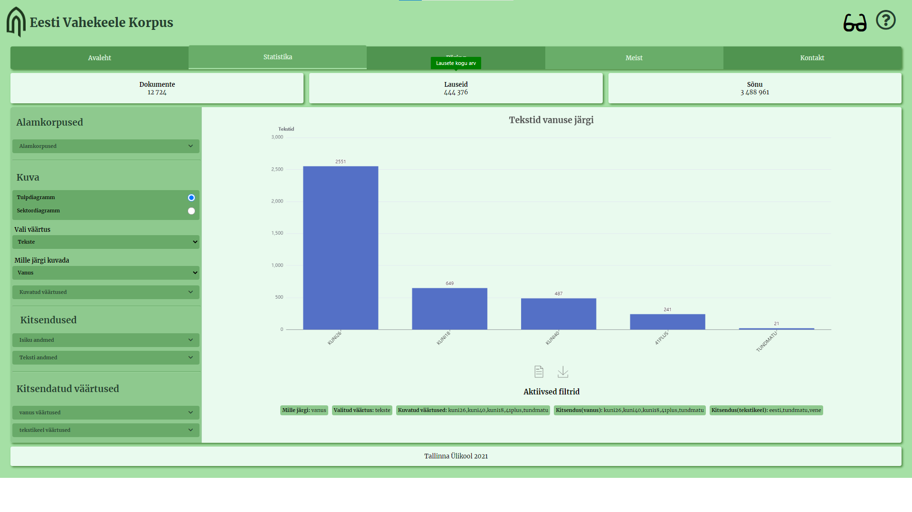
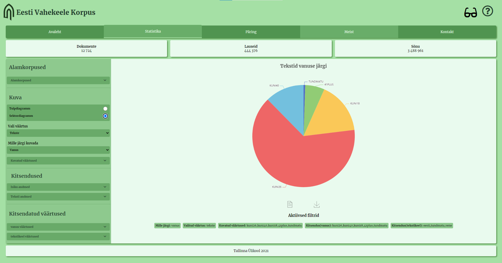

# Eesti Vahekeele Korpuse Interaktiivne statistika leht

### Ekraanipilt: siis kui toode on valmis



### Eesmärk: 
Interaktiivse statistika lehekülje eesmärgiks võimaldada huvilistel uurida ja võrrelda Eesti vahekeele korpuse statistiliseid andmeid graafilisel kujul. Kasutaja soovide kohaselt kujundatud graafiku või tabeli saab mugavalt alla laadida, mis laseb veebilehelt saadud andmeid juba iga kasutaja isiklikke vajaduste järgi edasi töödelda.

### Viide instituudile:
https://www.tlu.ee/dt
Projekt on loodud Tallinna Ülikoolis Informaatika erialal oleva Tarkvara arenduse projekti aine raames.

### Viide litsentsile:
Copyright <2021> <Tallina Ülikool>

Permission is hereby granted, free of charge, to any person obtaining a copy of this software and associated documentation files (the "Software"), to deal in the Software without restriction, including without limitation the rights to use, copy, modify, merge, publish, distribute, sublicense, and/or sell copies of the Software, and to permit persons to whom the Software is furnished to do so, subject to the following conditions:

The above copyright notice and this permission notice shall be included in all copies or substantial portions of the Software.

THE SOFTWARE IS PROVIDED "AS IS", WITHOUT WARRANTY OF ANY KIND, EXPRESS OR IMPLIED, INCLUDING BUT NOT LIMITED TO THE WARRANTIES OF MERCHANTABILITY, FITNESS FOR A PARTICULAR PURPOSE AND NONINFRINGEMENT. IN NO EVENT SHALL THE AUTHORS OR COPYRIGHT HOLDERS BE LIABLE FOR ANY CLAIM, DAMAGES OR OTHER LIABILITY, WHETHER IN AN ACTION OF CONTRACT, TORT OR OTHERWISE, ARISING FROM, OUT OF OR IN CONNECTION WITH THE SOFTWARE OR THE USE OR OTHER DEALINGS IN THE SOFTWARE.


### Kasutatud tehnoloogiad ja nende versioonid:
* Ubuntu 20.4
* Java jdk 11.0.11
* Docker 19.03
* NodeJS 10.19.0
* Yarn 1.22.10

### Projekti osalised:

Hans-Märten Liiu

Jan-Erik Läänesaar

Markus Veem

Markus Tammeoja

Ron Arnar Pehka

Jaagup Kippar


## Keskkonna ülesseadmine

### Kirjutage Windowsi otsingusse Powershell ning avage rakendus administraatorina. Kui powershell tuli lahti, sisestage sinna järgnevad käsklused:
### Peale käskude sisestamist tuleb arvuti taaskäivitada, muidu pole võimalik protsessi jätkata!
```bash
dism.exe /online /enable-feature /featurename:Microsoft-Windows-Subsystem-Linux /all /norestart
```
```bash
dism.exe /online /enable-feature /featurename:VirtualMachinePlatform /all /norestart
```

### Kui taaskäivitus on tehtud, laadige alla järgnev komponent: 

https://wslstorestorage.blob.core.windows.net/wslblob/wsl_update_x64.msi 

Peale seda käivitage allalaetud komponent  ning laske sellel end ära installeerida.

### Kirjutage Windowsi otsingusse Powershell ning avage rakendus administraatorina. Kui powershell tuli lahti, sisestage sinna järgnev käsklus:
```bash
wsl --set-default-version 2
```

### Laadige Microsofti poest alla Ubuntu 20.4 Lts

https://www.microsoft.com/store/apps/9n6svws3rx71

Rakenduse allalaadimiseks pole vajalik kasutajakonto olemasolu, seega iga kord kui küsitakse kontoga sisse logimist, sulgege see aken. Peale seda peaks rakendus ära installima.

### Kirjutage Windowsi otsingusse Ubuntu ning avage see rakendus

Olles Ubuntu keskkonnas tuleb teil luua kasutajanimi ning parool, mida pakub programm teile automaatselt. Soovitatavalt kasutage lihtsasti meeldejäävat kasutajatunnust ja parooli.

### Kui kasutaja on loodud, sisestage järgnev käsklus:
```bash
sudo apt-get update && sudo apt install openjdk-11-jdk-headless && sudo apt install docker-compose
```

### Peale seda kopeerige terve järgnev tekstilõik:
```bash
sudo apt-get update
sudo apt-get install \
    apt-transport-https \
    ca-certificates \
    curl \
    gnupg \
    lsb-release
```

### Siis sisestage ükshaaval kõik järgnevad käsklused:
```bash
curl -fsSL https://download.docker.com/linux/ubuntu/gpg | sudo gpg --dearmor -o /usr/share/keyrings/docker-archive-keyring.gpg
```

```bash
echo \
  "deb [arch=amd64 signed-by=/usr/share/keyrings/docker-archive-keyring.gpg] https://download.docker.com/linux/ubuntu \
  $(lsb_release -cs) stable" | sudo tee /etc/apt/sources.list.d/docker.list > /dev/null
```

```bash
sudo apt-get update
```
```bash
sudo apt-get install docker-ce docker-ce-cli containerd.io
```

### Sisestage järgnev käsklus ning jätke see aken taustale lahti
```bash
sudo dockerd
```

### Kirjutage Windowsi otsingusse Ubuntu ning avage uus Ubuntu aken ja sisestage järgnev käsklus:
```bash
sudo apt install nodejs && sudo apt install npm && sudo npm install -g yarn && sudo apt install unzip
```


## Keskkonna käivitamine
```bash
mkdir evkk && cd evkk && wget https://github.com/centre-for-educational-technology/evkk/archive/refs/heads/master.zip
```

### Kirjutage allolev käsklus, et kontrollida kas tarkvara laadis end alla:
```bash
ls
```

### Kui tarkvara laadis end alla,  kirjutage allolev käsklus:
```bash
unzip master.zip
```

### Seejärel kirjutage kõik allolevad käsklused eraldi Ubuntu akendesse.
**Kindlasti oodake käsklused lõpuni enne kui liigute järgmisesse aknasse!**
```bash
cd evkk/evkk-main && sudo compose-up
```
```bash
cd evkk/evkk-main && sudo ./gradlew:db:bootRun --args 'clean migrate seed'
```
```bash
cd evkk/evkk-main && ./gradlew :api:bootRun
```
```bash
cd evkk/evkk-main && yarn --cwd=./ui install && yarn --cwd=./ui start
```

**Kui kõik käsud said sisestatud, siis veebileht peaks automaatselt avanema järgmisel aadressil:**
localhost:3000/evkkTest


## Keskkonna käivitus peale esimese installeerimise lõpetamist ning arvuti taaskäivitamist

**Iga järgneva käivituse osa jaoks tuleb luua uus ubuntu aken:**
```bash
sudo dockerd
```
```bash
cd evkk/evkk-main && sudo compose-up
```
```bash
cd evkk/evkk-main && sudo ./gradlew:db:bootRun --args 'clean migrate seed'
```
```bash
cd evkk/evkk-main && ./gradlew :api:bootRun
```
```bash
cd evkk/evkk-main && yarn --cwd=./ui install && yarn --cwd=./ui start
```
### Testid ja testimise tulemused:

- [Link testimise dokumendile](https://docs.google.com/document/d/1P7JjFxXx7RJddUG7pZldC3zIrb_HHy1xk6GeuDOaUis/edit?usp=sharing)